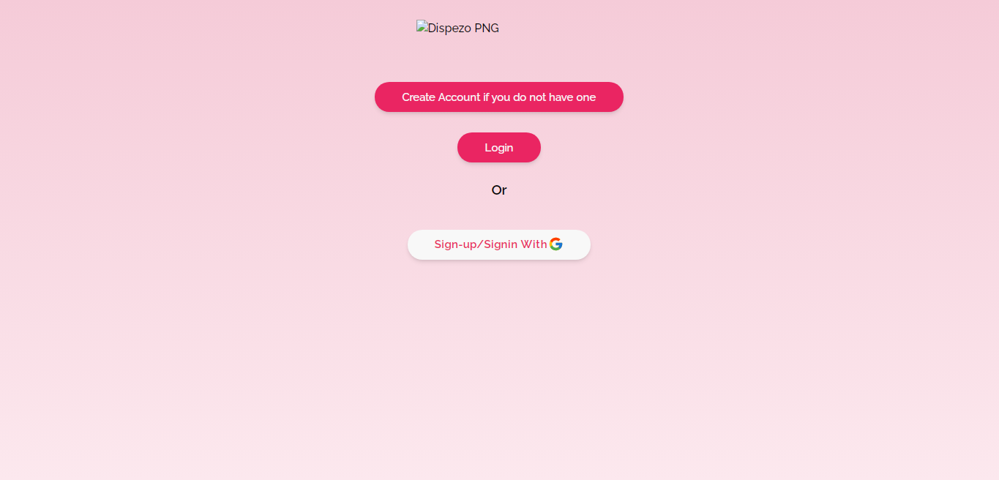
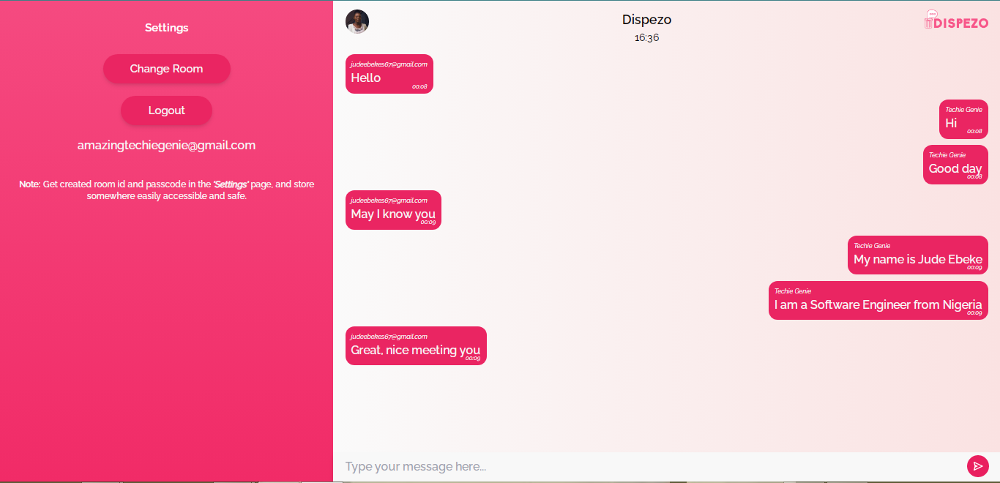

# Dispezo Chat App

Welcome to the Mini Chat App! This application allows users to engage in real-time text-based conversations with each other.

## Table of Contents

- [Description](#description)
- [Features](#features)
- [Technologies Used](#technologies-used)
- [Installation](#installation)
- [Usage](#usage)
- [Demo](#demo)
- [Screenshots](#screenshots)
- [Contact](#contact)

## Description

The Mini Chat App is a simple and lightweight chat application built using React, Tailwind CSS, and Firebase. It demonstrates real-time messaging functionality and provides an intuitive user interface. One of its core features is the ability to easily dispose of chats.

## Features

- Real-time Messaging: Engage in real-time text-based conversations.
- User Authentication: Users can sign in using their Google accounts or using an Email and Password.
- Responsive Design: The app is designed to work seamlessly on various devices and screen sizes.

## Technologies Used

- React: Frontend library for building user interfaces.
- Tailwind CSS: Utility-first CSS framework for styling.
- Firebase Firestore: Real-time cloud database for storing messages and user data.
- Firebase Authentication: For user authentication using Google accounts.

## Installation

1. Clone this repository: `git clone https://github.com/judeebeke/dispezo-app.git`
2. Navigate to the project directory: `cd dispezo-app`
3. Install dependencies: `npm install`

## Usage

1. Set up a Firebase project and enable Firestore and Google Authentication.
2. Add your Firebase configuration details in the appropriate files.
3. Start the development server: `npm run dev`

## Demo

Demo: https://dispezo.vercel.app;

## Screenshots

## Contact

- Website: https://ebekesjude.vercel.app
- LinkedIn: https://www.linkedin.com/in/jude-ebeke-b67813223
- Facebook: https://www.facebook.com/profile.php?id=100070522303715
- Email: judeebekes67@gmail.com
- Twitter/X: https://mobile.twitter.com/techie_genie
